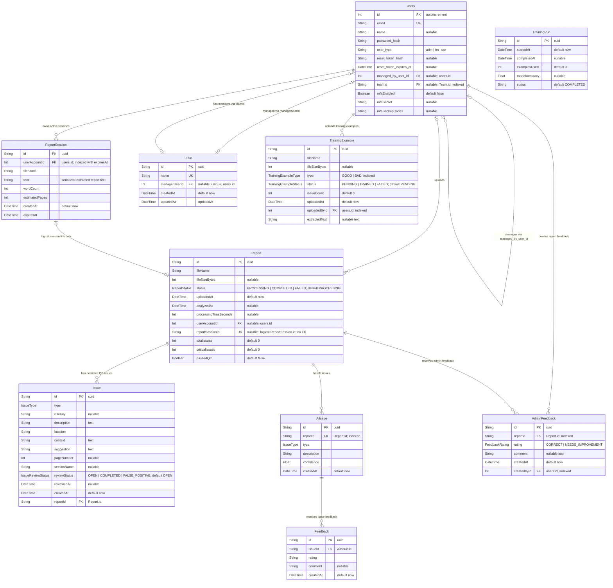

# Database ERD

Generated from [backend/prisma/schema.prisma](../backend/prisma/schema.prisma) and checked against the committed Prisma migrations and backend Prisma usage on 2026-04-20.

Use this Mermaid block directly in the GitLab wiki.

## Relationship Notes

- `users` is the physical table for the Prisma `UserAccount` model. `user_type` stores role codes: `adm` for Admin, `tm` for Team Manager, and `usr` for Consultant.
- A consultant can be connected to a team in two ways: `users.teamId` points to `Team.id`, and `users.managed_by_user_id` points to the manager user. Team service code keeps these in sync when team membership changes.
- `Team.managerUserId` is unique, so a team manager can manage at most one team and a team can have at most one manager.
- `ReportSession` stores short-lived extracted report text. After a report is persisted, the session row is deleted and `Report.reportSessionId` remains as a unique logical link. There is no database FK from `Report.reportSessionId` to `ReportSession.id`.
- `Issue` is the main persisted QC issue table used for report history, exports, analytics, and issue review status.
- `AiIssue` plus `Feedback` is a separate AI issue feedback path used by legacy/admin metrics code. The main AI learning dashboard uses `AdminFeedback` against `Report`.
- `TrainingRun` is standalone in the current schema. It stores run-level summary fields only and has no FK to `TrainingExample`.

## Current Schema Caveats

- `npx prisma validate` passes, but Prisma warns that `TrainingExample.uploadedById` and `AdminFeedback.createdById` are required while their relations specify `onDelete: SetNull`. To make the referential action coherent, either make those FK fields nullable or use a non-null action such as `Restrict`/`Cascade`.
- The current Prisma schema includes `users.mfaEnabled`, `users.mfaSecret`, `users.mfaBackupCodes`, `AiIssue`, and `Feedback`. The committed migration SQL in `backend/prisma/migrations` does not currently create those columns/tables. If a fresh environment is built with `prisma migrate deploy`, add a migration before relying on them.
- [backend/src/services/vector.service.ts](../backend/src/services/vector.service.ts) queries `AiIssue.embedding`, and [backend/src/repositories/issue.repository.ts](../backend/src/repositories/issue.repository.ts) accepts an optional `embedding` field, but `embedding` is not defined in `schema.prisma` or migrations. It is not included in the ERD until the schema confirms its type.
